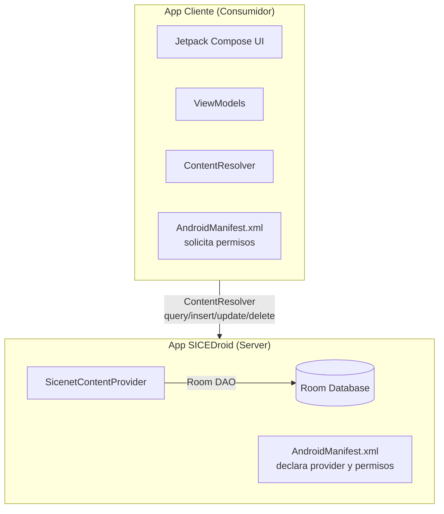

<!--firebender-plan
name: Content Provider SICEDroid
overview: Implementar un Content Provider seguro que exponga datos académicos (Kardex, Carga Académica, Calificaciones) con permisos de lectura/escritura, y una aplicación cliente con UI moderna que consuma dicho provider.
todos:
  - id: contract
    content: "Crear SicenetContract.kt con URIs y columnas expuestas"
  - id: provider
    content: "Implementar SicenetContentProvider con query/insert/update/delete"
  - id: manifest-server
    content: "Configurar permisos READ/WRITE en AndroidManifest de SICEDroid"
  - id: create-client
    content: "Crear proyecto Android nuevo: SICEDroid-Client"
  - id: manifest-client
    content: "Configurar permisos en AndroidManifest del cliente"
  - id: client-wrapper
    content: "Implementar SicenetProviderClient (wrapper ContentResolver)"
  - id: client-ui
    content: "Crear UI moderna con Compose para el cliente"
  - id: client-vm
    content: "Implementar ViewModels del cliente"
  - id: perms-screen
    content: "Crear pantalla de prueba de permisos"
  - id: testing
    content: "Probar integración entre ambas apps"
-->

## Plan: Content Provider en SICEDroid Compose

### 1. Arquitectura de la Solución



### 2. Modificaciones a SICEDroid (App Server)

#### 2.1 Crear `SicenetContentProvider.kt`
**Ubicación:** `app/src/main/java/com/example/marsphotos/data/provider/SicenetContentProvider.kt`

Implementar Content Provider que exponga:
- `content://com.example.marsphotos.provider/kardex` - Kardex
- `content://com.example.marsphotos.provider/carga` - Carga Académica  
- `content://com.example.marsphotos.provider/califunidad` - Calificaciones Parciales
- `content://com.example.marsphotos.provider/califfinal` - Calificaciones Finales
- `content://com.example.marsphotos.provider/student` - Perfil del Estudiante

#### 2.2 Definir Permisos Personalizados en `AndroidManifest.xml`
- `com.example.marsphotos.provider.READ` - Permiso de lectura
- `com.example.marsphotos.provider.WRITE` - Permiso de escritura

#### 2.3 Declarar el Provider en Manifest
Con `android:exported="true"`, `android:readPermission`, `android:writePermission`.

### 3. Crear Aplicación Cliente (Nuevo Proyecto)

#### 3.1 Estructura del Proyecto Cliente
```
SICEDroid-Client/
├── app/src/main/java/com/example/sicedroid_client/
│   ├── MainActivity.kt
│   ├── data/
│   │   └── SicenetProviderClient.kt  # Wrapper del ContentResolver
│   ├── model/
│   │   └── AcademicModels.kt         # Modelos de datos
│   ├── ui/
│   │   ├── theme/
│   │   └── screens/
│   │       ├── HomeScreen.kt
│   │       ├── KardexScreen.kt
│   │       ├── CargaScreen.kt
│   │       └── PermissionsScreen.kt
│   └── viewmodel/
│       └── AcademicViewModel.kt
```

#### 3.2 UI Moderna con Compose
- **HomeScreen**: Dashboard con acceso a todas las funciones
- **KardexScreen**: Visualización del historial académico
- **CargaScreen**: Carga académica actual con detalles
- **CalificacionesScreen**: Calificaciones parciales y finales
- **PermissionsScreen**: Panel para probar permisos (lectura/escritura)

#### 3.3 Solicitar Permisos en Manifest del Cliente
```xml
<uses-permission android:name="com.example.marsphotos.provider.READ"/>
<uses-permission android:name="com.example.marsphotos.provider.WRITE"/>
```

### 4. Métodos del Content Provider a Implementar

| Método | URI | Descripción |
|--------|-----|-------------|
| `query()` | `.../kardex` | Consultar kardex con filtros por matrícula |
| `query()` | `.../carga` | Consultar carga académica |
| `query()` | `.../califunidad` | Consultar calificaciones parciales |
| `query()` | `.../califfinal` | Consultar calificaciones finales |
| `query()` | `.../student` | Consultar perfil del estudiante |
| `insert()` | Todas las tablas | Insertar registros (valida permisos) |
| `update()` | Todas las tablas | Actualizar registros (valida permisos) |
| `delete()` | Todas las tablas | Eliminar registros (valida permisos) |
| `getType()` | Todas las URIs | Retornar MIME types correctos |

### 5. Mecanismos de Seguridad

- **Permiso READ**: Requerido para operaciones `query()`
- **Permiso WRITE**: Requerido para `insert()`, `update()`, `delete()`
- **URI Patterns**: Path matching específico para cada tabla
- **Validación de columnas**: Verificar que las columnas solicitadas existan

### 6. Flujo de Prueba

1. Instalar SICEDroid (con datos precargados)
2. Instalar App Cliente
3. Probar sin permisos → Debe fallar
4. Conceder permiso READ → Probar lectura
5. Intentar escritura sin permiso WRITE → Debe fallar
6. Conceder permiso WRITE → Probar inserción/actualización

### 7. Archivos a Modificar/Crear

**En SICEDroid:**
- Crear: `app/src/main/java/com/example/marsphotos/data/provider/SicenetContentProvider.kt`
- Crear: `app/src/main/java/com/example/marsphotos/data/provider/SicenetContract.kt` (URIs y columnas)
- Modificar: `app/src/main/AndroidManifest.xml`

**App Cliente (Nuevo Proyecto):**
- Crear: Estructura completa del proyecto cliente
- Crear: `MainActivity.kt`, ViewModels, Screens
- Crear: `SicenetProviderClient.kt` para abstraer ContentResolver
- Configurar: `AndroidManifest.xml` con permisos

### 8. Entregables

1. **Código fuente:**
   - Repositorio SICEDroid actualizado (con Content Provider)
   - Nuevo repositorio SICEDroid-Client (app consumidora)
   
2. **Informe técnico:** Documentar la arquitectura, permisos implementados, y flujo de datos.

3. **Capturas/videos:** Demostrar funcionamiento de permisos y UI.