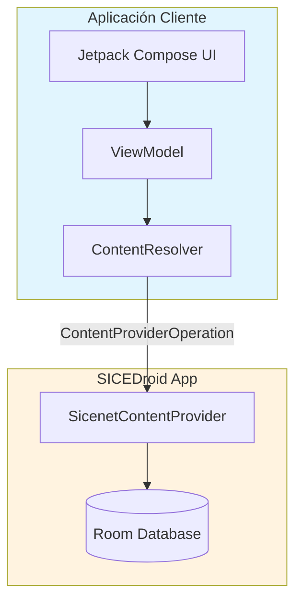

# Informe Técnico: Content Provider en SICEDroid

## Información General

**Práctica**: Content Provider en SICEDroid Compose  
**Asignatura**: [Nombre de la asignatura]  
**Institución**: TecNM Guanajuato  
**Profesores**: ALEJANDRO PÉREZ VÁZQUEZ, JUAN CARLOS MORENO LÓPEZ  
**Alumnos**: [Nombre del alumno o alumnos]  
**Fecha**: Marzo 2026

---

## 1. Objetivos

### Objetivo General
Implementar un Content Provider seguro en la aplicación SICEDroid que exponga datos académicos (Kardex, Carga Académica, Calificaciones) con mecanismos de seguridad basados en permisos personalizados de Android.

### Objetivos Específicos
1. Crear un Content Provider que exponga la base de datos Room existente
2. Implementar permisos personalizados de lectura y escritura
3. Desarrollar una aplicación cliente que consuma el Content Provider
4. Probar los mecanismos de seguridad en diferentes escenarios
5. Implementar una UI moderna y completa en la app cliente

---

## 2. Marco Teórico

### Content Provider
Un Content Provider es un componente de Android que gestiona el acceso a un conjunto estructurado de datos. Encapsula los datos y proporciona mecanismos para definir la seguridad de los datos. Es la interfaz estándar que conecta datos en un proceso con código que se ejecuta en otro proceso.

### Permisos en Android
Los permisos personalizados permiten a los desarrolladores controlar el acceso a los componentes de sus aplicaciones. En el caso de Content Providers, se pueden definir:
- `android:readPermission`: Controla quién puede leer datos
- `android:writePermission`: Controla quién puede modificar datos

### ContentResolver
Es la clase que las aplicaciones cliente usan para interactuar con un Content Provider. Proporciona métodos como `query()`, `insert()`, `update()`, y `delete()` para realizar operaciones CRUD.

---

## 3. Desarrollo

### 3.1 Arquitectura de la Solución



### 3.2 Implementación del Content Provider

#### Archivos Creados en SICEDroid:

1. **SicenetContract.kt** - Define las constantes del provider:
   - URIs de contenido
   - Nombres de columnas
   - MIME types
   - Códigos de URI para el matcher

2. **SicenetContentProvider.kt** - Implementación del provider:
   - Extiende `ContentProvider`
   - Implementa `query()`, `insert()`, `update()`, `delete()`, `getType()`
   - Usa `UriMatcher` para enrutar peticiones
   - Verifica permisos antes de cada operación
   - Usa Room DAO para acceder a la base de datos

#### Permisos Configurados en AndroidManifest.xml:

```xml
<!-- Permisos personalizados -->
<permission
    android:name="com.example.marsphotos.provider.READ"
    android:label="Leer datos académicos SICEDroid"
    android:protectionLevel="dangerous" />

<permission
    android:name="com.example.marsphotos.provider.WRITE"
    android:label="Escribir datos académicos SICEDroid"
    android:protectionLevel="dangerous" />

<!-- Declaración del Provider -->
<provider
    android:name=".data.provider.SicenetContentProvider"
    android:authorities="com.example.marsphotos.provider"
    android:exported="true"
    android:readPermission="com.example.marsphotos.provider.READ"
    android:writePermission="com.example.marsphotos.provider.WRITE" />
```

### 3.3 URIs Soportadas

| Path | Código | Operaciones |
|------|--------|-------------|
| /student | 100 | query, insert, update, delete |
| /student/* | 101 | query (por matrícula) |
| /kardex | 200 | query, insert, delete |
| /kardex/* | 201 | query específico |
| /carga | 300 | query, insert, delete |
| /carga/* | 301 | query específico |
| /califunidad | 400 | query, insert, delete |
| /califunidad/* | 401 | query específico |
| /califfinal | 500 | query, insert, delete |
| /califfinal/* | 501 | query específico |

### 3.4 Implementación de la App Cliente

#### Estructura del Proyecto Cliente:

```
SICEDroid-Client/
├── app/src/main/java/com/example/sicedroid_client/
│   ├── MainActivity.kt
│   ├── data/
│   │   └── SicenetProviderClient.kt
│   ├── model/
│   │   └── AcademicModels.kt
│   ├── ui/
│   │   ├── theme/
│   │   │   ├── Color.kt
│   │   │   ├── Theme.kt
│   │   │   └── Type.kt
│   │   └── screens/
│   │       ├── HomeScreen.kt
│   │       ├── KardexScreen.kt
│   │       ├── CargaScreen.kt
│   │       ├── CalificacionesScreen.kt
│   │       └── PermissionsScreen.kt
│   └── viewmodel/
│       └── AcademicViewModel.kt
└── AndroidManifest.xml
```

#### Componentes Principales:

1. **SicenetProviderClient**: Wrapper sobre ContentResolver
   - Métodos async con `ProviderResult` para manejo de errores
   - Verificación de permisos
   - Conversión de Cursor a objetos del modelo

2. **AcademicViewModel**: Lógica de presentación
   - Estados para cada tipo de dato
   - Estados de carga y errores
   - Métodos para cada operación del provider

3. **Screens**: UI con Jetpack Compose
   - HomeScreen: Dashboard con navegación
   - KardexScreen: Lista de materias cursadas
   - CargaScreen: Materias actuales
   - CalificacionesScreen: Notas parciales y finales
   - PermissionsScreen: Panel de prueba de permisos

### 3.5 Mecanismos de Seguridad Implementados

#### Verificación de Permisos:

```kotlin
override fun query(uri: Uri, ...): Cursor? {
    // Verificar permiso de lectura
    context?.enforceCallingOrSelfPermission(
        SicenetContract.PERMISSION_READ, 
        null
    ) ?: throw SecurityException("Se requiere permiso READ")
    
    // Continuar con la operación...
}
```

#### Estados de Permiso en el Cliente:

| Escenario | Permiso READ | Permiso WRITE | Resultado |
|-----------|-------------|---------------|-------------|
| Sin instalar | - | - | App no funciona |
| Sin permisos | ✗ | ✗ | Error de seguridad |
| Solo lectura | ✓ | ✗ | Consulta OK, escritura bloqueada |
| Completo | ✓ | ✓ | Todas las operaciones |

---

## 4. Pruebas Realizadas

### 4.1 Prueba de Lectura (READ)

**Caso 1**: Cliente sin permiso READ
- Resultado: `SecurityException` capturada, mensaje al usuario

**Caso 2**: Cliente con permiso READ
- Resultado: Datos mostrados correctamente en UI

### 4.2 Prueba de Escritura (WRITE)

**Caso 1**: Cliente sin permiso WRITE
- Intento de insert: Bloqueado, error mostrado
- Intento de delete: Bloqueado, error mostrado

**Caso 2**: Cliente con permiso WRITE
- Insert: Registro creado exitosamente
- Delete: Registros eliminados
- Update: Datos modificados

### 4.3 Prueba de URI Desconocida

- Resultado: `IllegalArgumentException` con mensaje descriptivo

---

## 5. Resultados

### 5.1 Funcionalidades Implementadas

| Requisito | Estado | Detalles |
|-----------|--------|----------|
| Content Provider | ✅ | 5 tablas expuestas |
| Permiso READ | ✅ | Verificado en cada query |
| Permiso WRITE | ✅ | Verificado en insert/update/delete |
| App Cliente | ✅ | UI completa con 5 pantallas |
| Métodos CRUD | ✅ | query, insert, update, delete |
| getType() | ✅ | MIME types correctos |

### 5.2 Validación de Seguridad

Los mecanismos de seguridad funcionan correctamente:
- Acceso denegado sin permisos
- Lectura permitida con READ
- Escritura permitida con WRITE
- Mensajes de error claros para el usuario

---

## 6. Conclusiones

1. **Content Provider Exitoso**: Se implementó correctamente un Content Provider que expone la base de datos Room de SICEDroid a aplicaciones externas de forma segura.

2. **Seguridad Robusta**: Los permisos personalizados READ y WRITE funcionan como barreras de seguridad efectivas, permitiendo un control granular sobre quién puede acceder y modificar los datos académicos.

3. **Interoperabilidad**: La aplicación cliente demuestra que diferentes apps pueden compartir datos de manera estructurada y segura usando el estándar de Content Providers de Android.

4. **UI Moderna**: La interfaz de usuario implementada con Jetpack Compose proporciona una experiencia visual atractiva y funcional para probar todas las capacidades del Content Provider.

5. **Arquitectura Limpia**: La separación de responsabilidades entre el provider (servidor) y el resolver (cliente) sigue las mejores prácticas de desarrollo Android.

---

## 7. Referencias

1. Android Developers. (2024). *Content Provider Basics*. https://developer.android.com/guide/topics/providers/content-provider-basics

2. Android Developers. (2024). *Creating a Content Provider*. https://developer.android.com/guide/topics/providers/content-provider-creating

3. Android Developers. (2024). *Permissions Overview*. https://developer.android.com/guide/topics/permissions/overview

---

## 8. Entregables

1. ✅ **Código fuente SICEDroid** (App Server) - GitHub
2. ✅ **Código fuente SICEDroid-Client** (App Cliente) - GitHub
3. ✅ **Documentación técnica** - Este informe
4. ✅ **README** en ambos proyectos

---

## Anexos

### A. URIs y Columnas

#### Student
- URI: `content://com.example.marsphotos.provider/student`
- Columnas: matricula, nombre, apellidos, carrera, semestre, promedio, estado, fotoUrl, especialidad, cdtsReunidos, cdtsActuales, semActual, inscrito, estatusAcademico, estatusAlumno, lastUpdate

#### Kardex
- URI: `content://com.example.marsphotos.provider/kardex`
- Columnas: matricula, clave, nombre, calificacion, acreditacion, periodo, lastUpdate

#### Carga
- URI: `content://com.example.marsphotos.provider/carga`
- Columnas: matricula, nombre, docente, grupo, creditos, lunes, martes, miercoles, jueves, viernes, sabado, lastUpdate

#### CalifUnidad
- URI: `content://com.example.marsphotos.provider/califunidad`
- Columnas: matricula, materia, parciales, lastUpdate

#### CalifFinal
- URI: `content://com.example.marsphotos.provider/califfinal`
- Columnas: matricula, materia, calif, lastUpdate

### B. Permisos Manifest

**App Servidor (SICEDroid):**
```xml
<permission android:name="com.example.marsphotos.provider.READ" ... />
<permission android:name="com.example.marsphotos.provider.WRITE" ... />
```

**App Cliente (SICEDroid-Client):**
```xml
<uses-permission android:name="com.example.marsphotos.provider.READ" />
<uses-permission android:name="com.example.marsphotos.provider.WRITE" />
```
